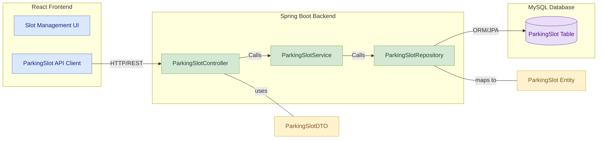
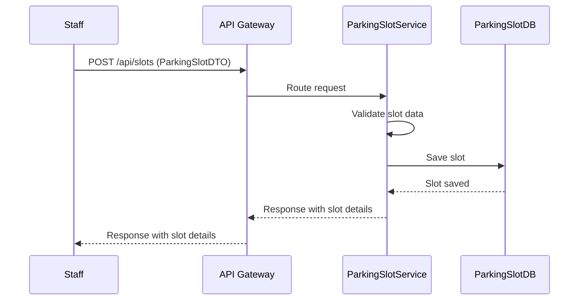

# Parking Slot Management Module: Low-Level Design Document

This document provides a detailed low-level overview of the `Parking Slot Management Module`, a  microservice within the Vehicle Parking Management System (vPMS) responsible for all parking slot-related operations Occupancy status.

---

## Table of Contents

1. [Project Overview](#1-project-overview)  
    * [Features](#11-features)  
2. [Architecture](#2-architecture)  
    * [Component Diagram](#21-component-diagram)  
    * [Sequence Diagram](#22-sequence-diagram)   
3. [Database Design](#3-database-design)  
    * [Parking Slot Table](#31-parking-slot-table)  
4. [API Endpoints](#4-api-endpoints)  
    * [Parking Slot Management Endpoints](#41-parking-slot-management-endpoints)  
    * [Swagger Documentation](#42-swagger-documentation)  
5. [Error Handling](#5-error-handling)  
6. [Dependencies](#6-dependencies)  
    * [Key Dependencies](#61-key-dependencies)  
7. [Deployment Instructions](#7-deployment-instructions)  
    * [Key Configuration](#71-key-configuration)  
    * [Steps to Deploy](#72-steps-to-deploy)  

---

## 1. Project Overview

The **parking-slot-service** module is a core component of the Parking Management System (PMS), dedicated to managing parking slot inventory, slot types, and occupancy status. It provides APIs for adding, updating, removing, and querying parking slots, as well as for changing and retrieving occupancy status.

### 1.1 Features

#### Manage Parking Slot Inventory
- Allows adding, updating, and removing parking slots.
- Ensures data integrity and validation during slot operations.

#### Retrieve Parking Slot Details
- Fetches details of specific parking slots using slot ID.
- Provides information such as slot type, occupancy status, and location.

#### Retrieve All Parking Slots
- Enables fetching all parking slots in the system.
- Supports filtering by slot type and occupancy status for efficient data handling.

#### Update Occupancy Status
- Updates the occupancy status of a parking slot.
- Ensures accurate tracking of slot availability.

#### Retrieve Occupancy Summary
- Provides a summary of occupied and available slots.
- Helps in monitoring parking slot utilization effectively.

---

## 2. Architecture

The `parking-slot-service` module is built using **Spring Boot** and follows a layered architecture. It communicates with other services via **REST APIs** and uses **MySQL** as its database.

### 2.1 Component Diagram


---

### 2.2 Sequence Diagram


---

## 3. Database Design

### 3.1 Parking Slot Table

| Column Name | Data Type | Description                     |
|-------------|-----------|---------------------------------|
| slotId      | Long      | Primary key (auto-generated)   |
| type        | String    | Slot type (e.g., 2W, 4W)       |
| isOccupied  | Boolean   | Occupancy status               |
| location    | String    | Physical location/identifier   |

---

## 4. API Endpoints

### 4.1 Parking Slot Management Endpoints


| Endpoint                                | Method | Description                                                    | Request Body/Params                          |
|-----------------------------------------|--------|----------------------------------------------------------------|----------------------------------------------|
| `/api/slots`                            | POST   | Add a parking slot                                             | ParkingSlotDTO                               |
| `/api/slots/{slotId}`                   | PUT    | Update a parking slot                                          | ParkingSlotDTO                               |
| `/api/slots/{slotId}`                   | DELETE | Remove a parking slot                                          | slotId (Path Variable)                       |
| `/api/slots`                            | GET    | Retrieve all slots                                             | None                                         |
| `/api/slots/available`                  | GET    | Retrieve available slots                                       | None                                         |
| `/api/slots/type/{type}`                | GET    | Retrieve slots by type                                         | type (Path Variable)                         |
| `/api/slots/{slotId}`                   | GET    | Retrieve slot by ID                                            | slotId (Path Variable)                       |
| `/api/slots/{slotId}/occupancy`         | PATCH  | Change occupancy status                                        | isOccupied (Request Param)                   |
| `/api/slots/occupancy-status`           | GET    | Get occupancy status summary                                   | None                                         |

### 4.2 Swagger Documentation

Comprehensive API documentation is available via Swagger UI, typically accessible at:  

**`http://localhost:8082/swagger-ui.html`**

---

## 5. Error Handling

The module uses Spring Boot's exception handling mechanism to ensure consistent and meaningful error responses. Below are the common error codes and their descriptions:

| Error Code | Description               |
|------------|---------------------------|
| 400        | Bad Request               |
| 404        | Resource Not Found        |
| 500        | Internal Server Error     |

Custom exception handlers are implemented to map specific exceptions to these HTTP status codes, providing detailed error messages for better debugging and user experience.

---

## 6. Dependencies

### Key Dependencies

- **spring-boot-starter-web**: RESTful web services  
- **spring-boot-starter-data-jpa**: JPA/Hibernate ORM  
- **spring-boot-starter-actuator**: Monitoring endpoints  
- **spring-cloud-starter-netflix-eureka-client**: Eureka registration  
- **lombok**: Boilerplate reduction  
- **mysql-connector-j**: MySQL JDBC driver  
- **springdoc-openapi-starter-webmvc-ui**: Swagger/OpenAPI docs  
- **spring-boot-devtools**: Hot reload for development  

---

## 7. Deployment Instructions

#### Key Configuration

Below is an excerpt from the `application.properties` file:

```properties
spring.application.name=parking-slot-service
server.port=8082
spring.datasource.url=jdbc:mysql://localhost:3306/parking_db
spring.datasource.username=root
spring.datasource.password=root
spring.datasource.driver-class-name=com.mysql.cj.jdbc.Driver
spring.jpa.hibernate.ddl-auto=update
spring.jpa.show-sql=true
eureka.client.service-url.defaultZone=http://localhost:8761/eureka/
eureka.instance.prefer-ip-address=true
eureka.instance.hostname=localhost
eureka.instance.instance-id=${spring.application.name}:${spring.application.instance_id:${random.value}}
```

#### Steps to Deploy

1. **Clone the Repository**  
    ```bash
    git clone <repository-url>
    ```

2. **Navigate to the Project Directory**  
    ```bash
    cd parking-slot-service
    ```

3. **Build the Project**  
    ```bash
    mvn clean install
    ```

4. **Run the Application**  
    ```bash
    mvn spring-boot:run
    ```

Ensure that the Eureka server and MySQL database are running before starting the application.

---

### Note

Ensure MySQL is running and the `parking_db` database exists.  
Eureka server should be running on port `8761` for service registration.  
Swagger UI is available at `/swagger-ui.html` for API exploration.  