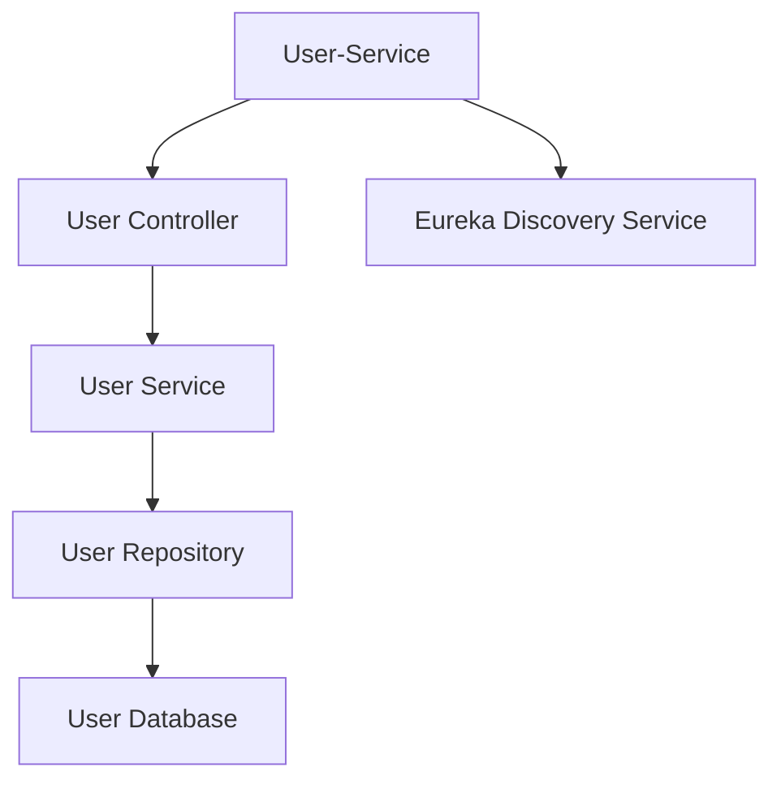
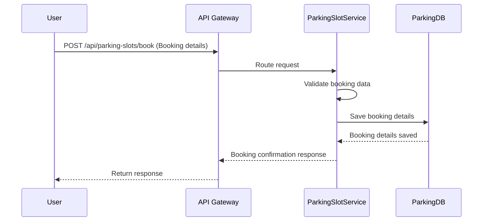

# Parking Slot Management Module: Low-Level Design Document

This document provides a detailed low-level overview of the `Parking Slot Management Module`, a core microservice within the Parking Management System (PMS) responsible for all parking slot-related operations.

---

## Table of Contents

1. [Introduction](#1-introduction)  
    * [1.1 Features](#11-features)  
2. [Architecture](#2-architecture)  
    * [2.1 Component Diagram](#21-component-diagram)  
    * [2.2 Technologies Used](#22-technologies-used)  
3. [Database Design](#3-database-design)  
    * [3.1 Parking Slot Table](#31-parking-slot-table)  
4. [API Endpoints](#4-api-endpoints)  
    * [4.1 Parking Slot Management Endpoints](#41-parking-slot-management-endpoints)  
    * [4.2 Parking Slot Booking Sequence Diagram](#42-parking-slot-booking-sequence-diagram)  
    * [4.3 Swagger Documentation](#43-swagger-documentation)  
5. [Error Handling](#5-error-handling)  
    * [5.1 Common Error Codes](#51-common-error-codes)  
6. [Dependencies](#6-dependencies)  
    * [6.1 Key Dependencies](#61-key-dependencies)  
7. [Deployment](#7-deployment)  
    * [7.1 Key Configuration](#71-key-configuration)  
    * [7.2 Deployment Steps](#72-deployment-steps)  

---

## 1. Introduction

The **`Parking Slot Management Module`** is a core microservice within the Vehicle Parking Management System (PMS) that is dedicated to handling all operations related to parking slots. This module is responsible for managing the lifecycle of parking slots—including their creation, modification, retrieval, and deletion—as well as tracking their occupancy status to ensure optimal parking resource utilization.

### 1.1 Features

- **Slot Registration**  
    - Allows the creation of new parking slots with essential details such as slot type (e.g., 2W or 4W), location, and initial occupancy status.  
    - Validates input data and ensures that each parking slot is uniquely identifiable.

- **Slot Retrieval**  
    - **By ID:** Enables fetching detailed information of a specific parking slot using its unique identifier.  
    - **All Slots:** Provides the functionality to list all registered parking slots with options for filtering, such as by availability or slot type.

- **Slot Management**  
    - Supports updating the details of an existing parking slot (e.g., changing the slot type, updating the location, or modifying the occupancy status).  
    - Facilitates the removal of parking slots when they are decommissioned or no longer in use.

- **Occupancy Monitoring**  
    - Tracks the occupancy status of parking slots in real-time by counting the number of occupied versus available slots.  
    - Offers a summary overview of occupancy, allowing for quick insights into parking resource utilization.

- **Integration & API Documentation**  
    - Exposes RESTful API endpoints that allow seamless communication with other PMS modules.  
    - Provides comprehensive API documentation via Swagger UI to assist developers in testing and integrating the service.

Designed with scalability and resilience in mind, this module plays a critical role in maintaining accurate parking slot data and ensuring efficient parking management across the system.
---

## 2. Architecture

The `User-Service` is built using **Spring Boot** with a **layered architecture** and communicates via REST APIs. Uses **H2** for in-memory DB during local development.

### 2.1 Component Diagram


```markdown
### 2.2 Component Diagram



### Layer Descriptions

- **User-Service:**  
  Acts as the entry point for the module, exposing RESTful APIs for external communication. It integrates with Eureka Discovery Service for service registration and discovery.

- **User Controller:**  
  Handles incoming HTTP requests and maps them to appropriate service methods. It serves as the interface between the client and the business logic.

- **User Service:**  
  Contains the core business logic of the application. It processes requests, applies validations, and interacts with the repository layer for data persistence.

- **User Repository:**  
  Responsible for database operations. It abstracts the data access layer and provides methods to interact with the User Database.

- **User Database:**  
  Stores user-related data such as user profiles, credentials, and preferences. It ensures data integrity and supports CRUD operations.

- **Eureka Discovery Service:**  
  Facilitates service discovery and registration, enabling seamless communication between microservices in a distributed architecture.


### 2.2 Technologies Used

- **Framework:** Spring Boot  
- **Database:** MySQL  
- **Language:** Java  
- **Build Tool:** Maven  

---

## 3. Database Design

### 3.1 Parking Slot Table

| Column Name | Data Type | Description                                              |
|-------------|-----------|----------------------------------------------------------|
| slotId      | Long      | Primary key (auto-generated) for the parking slot        |
| type        | String    | Type of slot (e.g., 2W or 4W)                              |
| isOccupied  | Boolean   | Indicates whether the slot is currently occupied         |
| location    | String    | Physical location details (e.g., floor, area)            |

---

## 4. API Endpoints

### 4.1 Parking Slot Management Endpoints

| Endpoint                                | Method | Description                                                    | Request Body/Params                          |
|-----------------------------------------|--------|----------------------------------------------------------------|----------------------------------------------|
| `/api/slots/`                           | POST   | Create a new parking slot                                      | ParkingSlot object                           |
| `/api/slots/{slotId}`                    | PUT    | Update an existing parking slot                                | Path Variable: slotId, ParkingSlot object    |
| `/api/slots/{slotId}`                    | DELETE | Remove a parking slot                                            | Path Variable: slotId                        |
| `/api/slots`                            | GET    | Retrieve all parking slots                                     | None                                         |
| `/api/slots/available`                   | GET    | Retrieve all available parking slots                           | None                                         |
| `/api/slots/occupancy-status`            | GET    | Get a summary of occupancy (occupied vs. available)            | None                                         |
| `/api/slots/type/{type}`                 | GET    | Retrieve parking slots filtered by type                        | Path Variable: type                          |
| `/api/slots/{slotId}`                    | GET    | Retrieve parking slot details by ID                            | Path Variable: slotId                        |
| `/api/slots/{slotId}/occupancy`          | PATCH  | Change the occupancy status of a parking slot                  | Path Variable: slotId, Request Param: isOccupied |

### 4.2 Parking Slot Booking Sequence Diagram


### 4.3 Swagger Documentation

Comprehensive API documentation is available via Swagger UI, typically accessible at:  

**`http://localhost:8082/swagger-ui.html`**

**Available Endpoints:**

| HTTP Method | Endpoint                                    | Description                                                     |
|-------------|---------------------------------------------|-----------------------------------------------------------------|
| POST        | `/api/slots`                                | Create a new parking slot                                       |
| PUT         | `/api/slots/{slotId}`                       | Update an existing parking slot                                 |
| DELETE      | `/api/slots/{slotId}`                       | Remove a parking slot                                           |
| GET         | `/api/slots`                                | Retrieve all parking slots                                      |
| GET         | `/api/slots/available`                      | Retrieve all available parking slots                            |
| GET         | `/api/slots/occupancy-status`               | Get a summary of occupancy (occupied vs. available)             |
| GET         | `/api/slots/type/{type}`                    | Retrieve parking slots filtered by type                         |
| GET         | `/api/slots/{slotId}`                       | Retrieve parking slot details by ID                             |
| PATCH       | `/api/slots/{slotId}/occupancy?isOccupied={status}` | Change the occupancy status of a parking slot (true/false)        |

---

### 7.2 Deployment Steps

1. **Build the Project**  
    Run the following command to build the project:  
    ```bash
    mvn clean install
    ```

2. **Run the Application Locally**  
    Execute the following command to start the service locally:  
    ```bash
    mvn spring-boot:run
    ```
